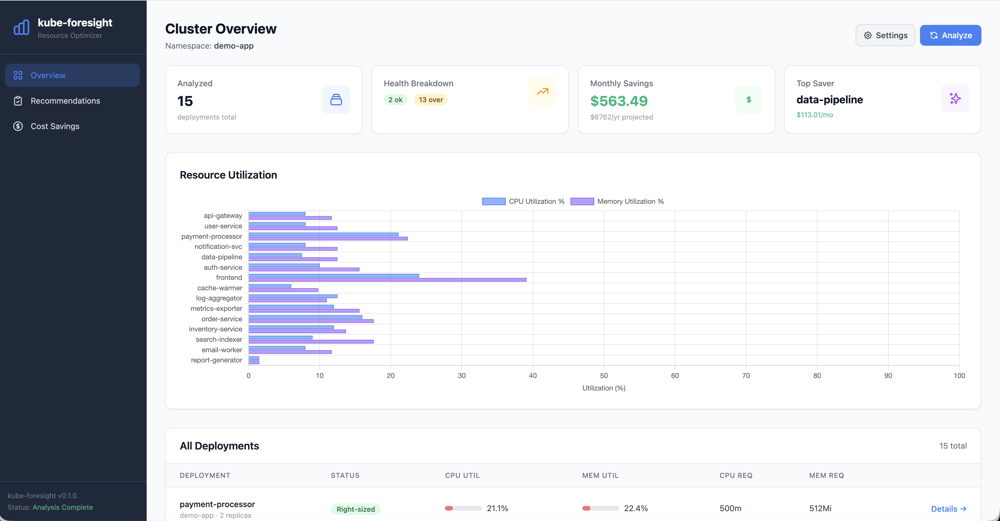
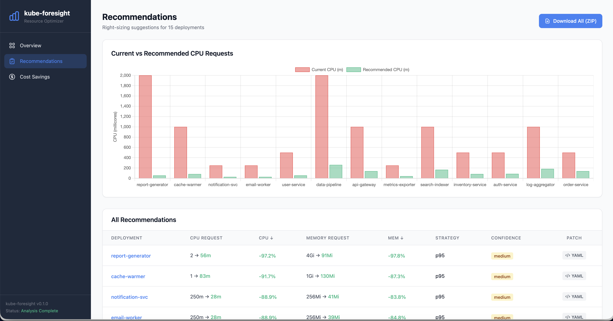

# kube-foresight

**Right-size your Kubernetes deployments, forecast resource trends, and see the multi-cloud cost impact — in one tool, with kubectl-ready patches.**

[](https://github.com/pallaprolus/kube-foresight/actions/workflows/ci.yml)
[](LICENSE)
[](https://www.python.org/)
[](https://pypi.org/project/kube-foresight/)
[](#status)



## Why kube-foresight?

Most teams over-provision Kubernetes by 40–70% out of fear of outages. Existing tools each solve a piece of this problem — kube-foresight ties the pieces together:

| Tool | Right-sizing recs | Patch output | Forecasting | Multi-cloud cost |
|------|:-:|:-:|:-:|:-:|
| **kube-foresight** | ✅ | ✅ kubectl YAML | ✅ breach prediction | ✅ AWS / GCP / Azure |
| Goldilocks (Fairwinds) | ✅ | — VPA objects | — | — |
| KRR (Robusta) | ✅ | — text suggestions | — | — |
| VPA (native) | ✅ | — auto-applies | — | — |
| Kubecost / OpenCost | partial | — | — | ✅ |

If you're already happy with KRR for recommendations and Kubecost for spend, you don't need this. **kube-foresight exists for the case where you want a single CLI / dashboard that says "here's the patch, here's when you'll breach, and here's the dollar delta on AWS vs GCP vs Azure."**

## Status

**Alpha — actively developed, not yet battle-tested in production.** Reports, issues, and PRs welcome. See [CHANGELOG / releases](https://github.com/pallaprolus/kube-foresight/releases).

## Try it in 30 seconds (no cluster needed)

```bash
pip install "kube-foresight[dashboard]"
kube-foresight demo                 # full pipeline against synthetic data
kube-foresight dashboard --demo     # web UI at http://localhost:8080
```



## Use it on a real cluster

```bash
# 1. Identify over-provisioned deployments (Metrics API or Prometheus)
kube-foresight analyze   -n production --mode k8s
kube-foresight recommend -n production --mode prometheus -p http://prometheus:9090

# 2. Generate kubectl-ready patches
kube-foresight patch -n production --mode k8s -o ./patches
kubectl apply -f ./patches/api-gateway-patch.yaml

# 3. Forecast when usage will breach current limits
kube-foresight forecast -n production --mode k8s
```

## What's in the box

- **Three collectors** — Kubernetes Metrics API, Prometheus, or mock (for demo / CI)
- **Statistical right-sizing** — p95 / p99 / max strategies with IQR anomaly filtering and configurable headroom
- **Forecasting** — linear regression on historical usage with breach-time prediction and risk classification
- **Multi-cloud cost estimation** — AWS / GCP / Azure pricing side-by-side
- **Patch generator** — strategic-merge YAML you can `kubectl apply`
- **Web dashboard** — FastAPI + HTMX + Chart.js (overview, recommendations, cost comparison)
- **HPA conflict detection** — refuses to recommend changes that fight your autoscaler
- **Production plumbing** — Dockerfile, Helm chart, health probes, structured JSON logs, optional Slack alerts

## CLI reference

| Command | Purpose |
|---------|---------|
| `demo` | Full pipeline with synthetic data — no cluster required |
| `analyze` | Identify over-provisioned deployments |
| `collect` | Snapshot metrics into SQLite for trend analysis |
| `recommend` | Right-sizing recommendations + cost estimates |
| `patch` | Generate kubectl-applyable YAML patches |
| `forecast` | Predict resource trends and breach timelines |
| `dashboard` | Launch the web UI |

Common flags: `--namespace/-n`, `--mode/-m {mock,k8s,prometheus}`, `--prometheus-url/-p`, `--strategy/-s {p95,p99,max}`, `--headroom 0.20`, `--top 10`, `--lookback 168`.

## Deployment

### Docker

```bash
docker build -t kube-foresight .
docker run -p 8080:8080 kube-foresight dashboard --host 0.0.0.0 --port 8080 --demo
```

### Helm

```bash
helm install kube-foresight charts/kube-foresight \
  --set collector.mode=k8s \
  --set collector.namespaces=production \
  --set scheduler.enabled=true
```

See [`charts/kube-foresight/values.yaml`](charts/kube-foresight/values.yaml) for persistence, ingress, alerting, and authentication options.

## Configuration

All settings are environment variables prefixed `KF_`:

| Variable | Purpose | Default |
|----------|---------|---------|
| `KF_MODE` | Collector mode (`mock`, `k8s`, `prometheus`) | `k8s` |
| `KF_NAMESPACES` | Comma-separated namespaces | `default` |
| `KF_CLOUD_PROVIDER` | Pricing source: `aws`, `gcp`, `azure` | `aws` |
| `KF_SCHEDULER_ENABLED` | Background collect/analyze loop | `false` |
| `KF_COLLECT_INTERVAL` | Collection interval (seconds) | `300` |
| `KF_ANALYSIS_INTERVAL` | Analysis interval (seconds) | `900` |
| `KF_SLACK_WEBHOOK_URL` | Slack alerts for at-risk deployments | — |
| `KF_LOG_FORMAT` | `text` or `json` | `text` |

## Development

```bash
git clone https://github.com/pallaprolus/kube-foresight && cd kube-foresight
pip install -e ".[k8s,dashboard,dev]"
pytest tests/ -v --tb=short        # 248 tests
ruff check .
helm lint charts/kube-foresight
```

For codebase layout, conventions, and the data-flow diagram, see [`docs/architecture.md`](docs/architecture.md).

## Contributing

Issues and PRs are very welcome — particularly: real-world deployment reports, additional pricing providers, and validation of forecast accuracy on production traces. See [`CONTRIBUTING.md`](CONTRIBUTING.md) once filed.

## License

Apache License 2.0
